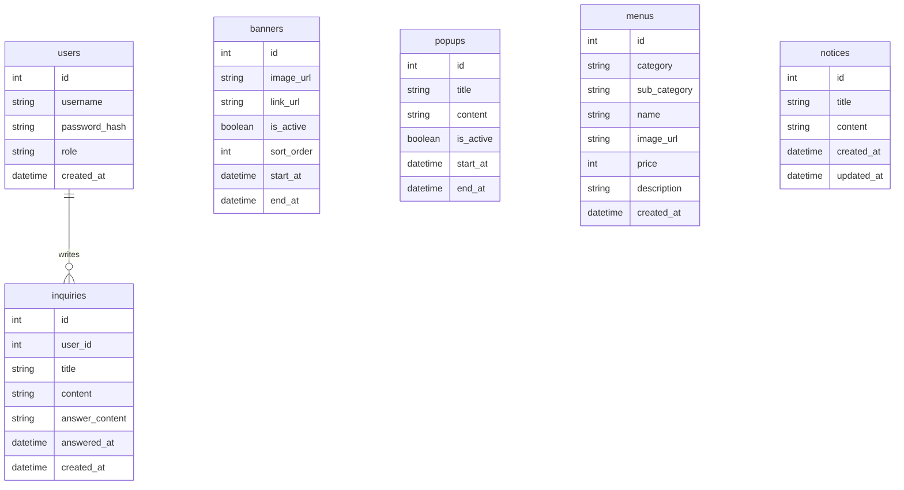

# ERD(Entity Relationship Document) — 배익거리(配益居里) 기업 홈페이지

**문서 버전**: v0.3
**작성자**: Nathan
**최초 작성일**: 2026-07-19
**최종 수정일**: 2026-07-19
**참조 TDD**: v0.11
**상태**: [x] 초안 / [ ] 진행 중 / [ ] 완료

---

## 0. 문서 목적

이 문서는 **배익거리 기업 홈페이지**의 데이터베이스 설계를 정의한다.
각 테이블의 역할, 컬럼 명세, 테이블 간 관계, 그리고 주요 설계 결정의 근거를 기록한다.
게시판/댓글 대신 메뉴(`menus`), 공지사항(`notices`), 상담글(`inquiries`)을 중심으로 설계되어 있으며, AI 관련 데이터는 존재하지 않는다.

---

## 1. 다이어그램

> `banners`, `popups`, `menus`, `notices`는 작성자(관리자)를 FK로 저장하지 않는다. 관리자 여부는 요청 시점의 `role` 검증만으로 충분하며, 콘텐츠 자체는 특정 관리자 개인에게 귀속시킬 필요가 없기 때문이다.

---

## 2. 테이블 명세

### 2-1. users

> 서비스에 가입한 사용자(일반 회원/관리자) 정보를 저장한다.

| 컬럼명 | 타입 | NULL | 기본값 | 키 | 설명 |
|---|---|---|---|---|---|
| `id` | `INT` | NOT NULL | AUTO_INCREMENT | PK | 고유 식별자 |
| `username` | `VARCHAR(50)` | NOT NULL | — | UK | 로그인 아이디 |
| `password_hash` | `VARCHAR(255)` | NOT NULL | — | — | bcrypt로 해싱된 비밀번호 |
| `role` | `ENUM('user','admin')` | NOT NULL | `'user'` | IDX | 사용자 권한 구분 |
| `created_at` | `DATETIME` | NOT NULL | `now()` | — | 가입 시각 |

**제약 조건**

- `username`은 유일해야 한다 → 아이디 중복 가입 방지

---

### 2-2. banners

> 메인페이지에 노출되는 배너 정보를 저장한다.

| 컬럼명 | 타입 | NULL | 기본값 | 키 | 설명 |
|---|---|---|---|---|---|
| `id` | `INT` | NOT NULL | AUTO_INCREMENT | PK | 고유 식별자 |
| `image_url` | `VARCHAR(255)` | NOT NULL | — | — | 배너 이미지 경로 |
| `link_url` | `VARCHAR(255)` | NULL | — | — | 클릭 시 이동할 링크 |
| `is_active` | `BOOLEAN` | NOT NULL | `true` | IDX | 노출 여부 |
| `sort_order` | `INT` | NOT NULL | `0` | — | 노출 순서 |
| `start_at` | `DATETIME` | NULL | — | — | 노출 시작 시각 |
| `end_at` | `DATETIME` | NULL | — | — | 노출 종료 시각 |

**제약 조건**

- 해당 없음

---

### 2-3. popups

> 메인페이지 접속 시 노출되는 팝업 정보를 저장한다.

| 컬럼명 | 타입 | NULL | 기본값 | 키 | 설명 |
|---|---|---|---|---|---|
| `id` | `INT` | NOT NULL | AUTO_INCREMENT | PK | 고유 식별자 |
| `title` | `VARCHAR(100)` | NOT NULL | — | — | 팝업 제목 |
| `content` | `TEXT` | NOT NULL | — | — | 팝업 본문 |
| `is_active` | `BOOLEAN` | NOT NULL | `true` | IDX | 노출 여부 |
| `start_at` | `DATETIME` | NULL | — | — | 노출 시작 시각 |
| `end_at` | `DATETIME` | NULL | — | — | 노출 종료 시각 |

**제약 조건**

- 해당 없음

---

### 2-4. menus

> 메뉴소개 화면에서 카테고리별로 노출되는 메뉴 정보를 저장한다.

| 컬럼명 | 타입 | NULL | 기본값 | 키 | 설명 |
|---|---|---|---|---|---|
| `id` | `INT` | NOT NULL | AUTO_INCREMENT | PK | 고유 식별자 |
| `category` | `ENUM('season','beverage','dessert')` | NOT NULL | — | IDX | 시즌메뉴/음료/디저트 상위 카테고리 구분 |
| `sub_category` | `ENUM('coffee','non_coffee','tea','ade_juice')` | NULL | — | IDX | 음료 하위 상세 카테고리(coffee/non-coffee/tea/ade·주스). `category='beverage'`일 때만 값을 가짐 |
| `name` | `VARCHAR(100)` | NOT NULL | — | — | 메뉴 이름 |
| `image_url` | `VARCHAR(255)` | NOT NULL | — | — | 메뉴 이미지 경로 |
| `price` | `INT` | NOT NULL | — | — | 가격(원) |
| `description` | `TEXT` | NULL | — | — | 메뉴 설명 |
| `created_at` | `DATETIME` | NOT NULL | `now()` | — | 등록 시각 |

**제약 조건**

- `category`는 정해진 3개 값(season/beverage/dessert) 중 하나여야 한다 → 사이드바 상위 카테고리와 1:1 대응
- `sub_category`는 `category='beverage'`인 경우에만 NOT NULL이어야 하고, 그 외(`season`, `dessert`)에는 NULL이어야 한다(애플리케이션 레벨 검증)

---

### 2-5. notices

> 고객센터에 노출되는 공지사항(휴무, 신메뉴, 채용 등)을 저장한다.

| 컬럼명 | 타입 | NULL | 기본값 | 키 | 설명 |
|---|---|---|---|---|---|
| `id` | `INT` | NOT NULL | AUTO_INCREMENT | PK | 고유 식별자 |
| `title` | `VARCHAR(200)` | NOT NULL | — | — | 공지 제목 |
| `content` | `TEXT` | NOT NULL | — | — | 공지 본문(HTML) |
| `created_at` | `DATETIME` | NOT NULL | `now()` | IDX | 작성 시각 |
| `updated_at` | `DATETIME` | NOT NULL | `now()` | — | 최종 수정 시각 |

**제약 조건**

- 해당 없음

---

### 2-6. inquiries

> 고객센터에서 로그인 사용자가 작성하는 1:1 상담글과 관리자 답변을 저장한다.

| 컬럼명 | 타입 | NULL | 기본값 | 키 | 설명 |
|---|---|---|---|---|---|
| `id` | `INT` | NOT NULL | AUTO_INCREMENT | PK | 고유 식별자 |
| `user_id` | `INT` | NOT NULL | — | FK → `users.id` | 작성자 |
| `title` | `VARCHAR(200)` | NOT NULL | — | — | 상담글 제목 |
| `content` | `TEXT` | NOT NULL | — | — | 상담글 내용 |
| `answer_content` | `TEXT` | NULL | — | — | 관리자 답변 내용 |
| `answered_at` | `DATETIME` | NULL | — | IDX | 답변 등록 시각(null이면 답변대기) |
| `created_at` | `DATETIME` | NOT NULL | `now()` | — | 작성 시각 |

**제약 조건**

- 상세 조회는 `user_id`가 본인이거나 요청자의 `role`이 `admin`인 경우에만 허용(애플리케이션 레벨 검증, 8-4 TDD 참고)

---

## 3. 관계 정의

| 관계 | 종류 | onDelete | 설명 |
|---|---|---|---|
| `users` → `inquiries` | 1 : N | `CASCADE` | 사용자가 삭제되면 작성한 상담글도 함께 삭제된다 |

**onDelete 정책 가이드**

| 정책 | 의미 | 적합한 경우 |
|---|---|---|
| `CASCADE` | 부모 삭제 시 자식도 함께 삭제 | 자식이 부모 없이 존재할 의미가 없는 경우 |
| `RESTRICT` | 자식이 있으면 부모 삭제 불가 | 자식 데이터를 보존해야 하는 경우 |
| `SET NULL` | 부모 삭제 시 FK를 NULL로 변경 | 자식이 부모 없이도 존재할 수 있는 경우 |

---

## 4. 인덱스 전략

| 테이블 | 인덱스 컬럼 | 종류 | 이유 |
|---|---|---|---|
| `users` | `username` | 단일(UK) | 로그인 시 아이디로 사용자 조회하는 쿼리 성능 개선 |
| `banners` | `is_active` | 단일 | 메인페이지 노출 배너 조회(`WHERE is_active = true`) 성능 개선 |
| `popups` | `is_active` | 단일 | 메인페이지 노출 팝업 조회(`WHERE is_active = true`) 성능 개선 |
| `menus` | `category`, `sub_category` | 각각 단일 | 사이드바에서 상위 카테고리(`WHERE category = ?`) 또는 음료의 하위 카테고리(`WHERE category = 'beverage' AND sub_category = ?`) 선택 시 필터링 성능 개선 |
| `notices` | `created_at` | 단일 | 공지사항 목록 최신순 정렬(`ORDER BY created_at DESC`) 성능 개선 |
| `inquiries` | `user_id` | 단일 | 본인 상담글 목록 조회(`WHERE user_id = ?`) 성능 개선 |
| `inquiries` | `answered_at` | 단일 | 답변대기/답변완료 상태 필터링·정렬 성능 개선 |

---

## 5. 설계 결정 사항

| 결정 | 선택 | 대안 | 이유 |
|---|---|---|---|
| PK 타입 | Auto Increment(정수) | UUID/CUID | 단일 서버·소규모 트래픽 환경으로 분산 환경 고려가 불필요, 조회 성능과 구현 단순성 우선 |
| 메뉴 카테고리 표현 방식 | `menus.category`(상위) + `menus.sub_category`(하위, nullable) 컬럼 분리 | 단일 평면 ENUM, 카테고리 테이블 분리(정규화) | 음료만 하위 카테고리(coffee/non-coffee/tea/ade·주스)를 갖는 비대칭 구조라 평면 ENUM으로는 표현이 부정확함. 카테고리 개수가 고정·소수(상위 3, 하위 4)라 별도 테이블 정규화는 과함 |
| 상담글 답변 저장 위치 | `inquiries` 테이블 내 컬럼(`answer_content`, `answered_at`) | 별도 `answers` 테이블 | 상담글 1건당 답변이 최대 1개인 1:1 관계라 테이블 분리가 과함 |
| 상담글 상태(답변대기/완료) 표현 | 별도 `status` 컬럼 없이 `answered_at`의 NULL 여부로 판단 | `status ENUM('pending','answered')` 컬럼 추가 | `answered_at`만으로 상태 파생이 가능해 중복 데이터를 두지 않음 |

---

## 6. DB 저장 범위 정의

| 데이터 | 저장 위치 | 이유 |
|---|---|---|
| 로그인 세션 정보 | 클라이언트 localStorage (JWT) | 서버에 세션 저장소를 별도로 두지 않고 토큰 기반으로 무상태 인증 처리 |
| 배너/팝업/메뉴/공지사항/상담글 | DB (`banners`, `popups`, `menus`, `notices`, `inquiries` 테이블) | 지속적으로 조회·관리되어야 하는 핵심 데이터이므로 |
| 기업소개(브랜드 스토리, 매장 안내) | DB 미저장, 프론트엔드 정적 콘텐츠 | 변경 빈도가 낮고 관리자 편집 요구사항이 없어 DB화가 과함(TDD 10장 참고) |

---

## 부록

### 버전 히스토리

| 버전 | 날짜 | 변경 내용 |
|---|---|---|
| v0.1 | 2026-07-19 | 최초 작성 |
| v0.2 | 2026-07-19 | PRD v0.2 반영 — AI 초안 관련 내용 삭제, `posts`/`comments` 테이블을 `menus`/`notices`/`inquiries`로 대체, 관리자 작성자 FK를 두지 않는 설계 원칙 명시 |
| v0.3 | 2026-07-19 | `menus` 카테고리 모델을 단일 평면 ENUM(6값)에서 `category`(시즌메뉴/음료/디저트)+`sub_category`(coffee/non_coffee/tea/ade_juice, 음료 전용 nullable) 2단 구조로 변경 |

### 용어 정의

| 용어 | 정의 |
|---|---|
| 상담글 | 고객센터에서 로그인 사용자가 작성하는 1:1 문의 게시글. 작성자 본인과 관리자만 상세 열람 가능하며, 관리자만 답변을 등록할 수 있다 |
| 시즌메뉴 | 특정 시즌·기간에 한정 판매되는 메뉴 카테고리 |
